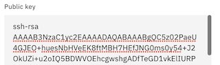

# Illustrating the Core Functionality of an Application Load Balancer and Instance Groups on IBM Cloud


## Introduction

This article serves as a guide to constructing a demonstration of an Application Load Balancer (ALB), illustrating exactly how they work, the motives for using one, and a few interesting experiments. Additionally, we'll observe the functionality of an IBM Cloud Instance Group, and illustrate how using one in conjunction with an ALB can help us deliver highly-available and scalable web applications.

ALBs play an important role in how enterprises deliver software (in this case, web-based applications) to their customers. A copious amount of deliberation should be put into validating this kind of architecture, including load balancer configurations, routing algorithms, health checks, persistent storage, etc. Proper consideration and configuration are vital to ensuring applications are fully functional and available to end users.

For a more detailed explanation on load balancing, visit this article from IBM: https://www.ibm.com/topics/load-balancing. Depending on your level of experience in the realm of networking, you may find that the experiments in this writeup are fairly rudimentary. The goal is to bring some foundational concepts to life with unique illustrations while reinforcing concepts vital to application uptime. This writeup should provide exercises appropriate for most experience levels.

We'll start by deploying properly configured VPC infrastructure, including an ALB and instance group, then tamper with the configurations enough to illustrate when and why it might break, why that behavior should or should not be expected, and how to avoid some common pitfalls.

## Prerequisites

An IBM Cloud account with Manager or higher permissions for VPC, and Editor or higher level platform permissions

*Use the code VPC1000 for $1,000 in IBM Cloud VPC credits! This will more than cover the cost of the lab, which will only be a nominal expense since we'll destroy the environment afterwards.*

Chrome, Edge, or Firefox are recommended, although Safari may suffice

## Phase 1 - Create a Virtual Private Cloud (VPC)

From the IBM Cloud Portal, create a VPC with the following configurations, most of which will be pre-populated for you:

**Location**: Region of your choice (Take note of this region, we will need to reference it again several times throughout the lab)

**Name**: lb-demo-vpc

**Resource group**: Default (others can be used as desired)

Maintain the default values of the remaining configurations, including:

- Default Security Group: Should remain checked, allowing SSH and PING

- Classic Access: can remain unchecked

- Default address prefixes: should remain checked

- Subnets: Default values, including address spaces should be used

Your VPC should be created within a few moments. **Navigate to your VPC**, then to the **Default Security Group** listed for your VPC.

From your default security group, navigate to the "**Rules**" tab.

First, as a best practice, let's restrict port 22 to your machine's IP address.

- Select "**Edit**" (using the ellipses) on the inbound rule in which the "Value" is listed as "Ports 22–22."

- In the "**Edit inbound rule**" pane, change "**Source Type**" to "**IP address**" and enter your machines IP address. You can retrieve your machine's IP address by navigating to https://www.ipchicken.com/ in a separate tab

- Keep in mind that your local network is likely using Network Address Translation, which (in short) means that your IP address is being assigned by the local router. In the event that you are completing this lab in multiple sittings in different locations, you'll want to update the IP address in this rule accordingly.

- Save the newly configured rule containing your IP address.

Next, create a new inbound rule with the following configurations.

**IMPORTANT**: Please note that adding this rule will expose virtual server instances that we create in later exercises to the internet over port 80 (HTML protocol). Please ensure you take the proper precautions. If you borrowed a colleague's VPC for this exercise (instead of creating a new VPC as shown in the steps above), please consider the repercussions and leverage strictly lab environments that do not have connectivity to company resources.

- Protocol: TCP
- Select "Port Range"
- Port min: 80
- Port max: 80
- Source type: Any

## Phase 2 - Create the Load Balancer

Within VPC Infrastructure, create a Load Balancer with the following configurations:

- Load balancer type: ALB
- Region: Same region as your VPC
- Name: lb-demo
- Resource Group: Default (others can be used as desired)
- Virtual Private Cloud: demo-vpc (that you created earlier)
- Type: Public
- DNS Type: Public
- Subnets: Select all three subnets

Create a back-end pool by clicking "Create pool" and enter the following configurations:

*Most of these configurations will be populated by default*

- Name: demo-pool
- Protocol: HTTP
- Session stickiness: None
- Proxy Protocol: Disabled
- Method: Round Robin
- Health Check Path: /
- Health Protocol: HTTP
- Health Port: Should remain blank
- Interval, Timeout, and Maximum Retries can retain their default values (5, 2, and 2 respectively)

Create a front-end listener by clicking "Create Listener," and enter the following configurations:

*Most of these configurations will be populated by default*

- Default back-end pool: demo-pool
- Protocol: HTTP
- Proxy protocol: should remain unchecked
- Listener port: 80
- Max connections: Should remain blank
- Timeout: Can retain its default value of 50 (seconds)

**Check over your configurations and click "Create" to begin provisioning the load balancer. This process will take a few minutes. While you wait, proceed to phase 3.**

## Phase 3 - Create an Instance Template

Within VPC Infrastructure, create an instance template with the following configurations.

- Server Type / Architecture: Intel
- Hosting type: Public
- Location: Same Region as your VPC, any zone
- Name: lb- demo
- Resource Group: Default (others can be used as desired)
- Operating System (Stock Image): Ubuntu Linux 22.04
- Profile: Balanced, bx2–2x8 (2 vCPUs | 8 GB RAM)
- SSH keys: If you have existing keys shown in the IBM Cloud portal, AND you still have the private key of the key pair on your local machine, feel free to select the appropriate existing key
- Otherwise:
    - Generate a new key pair on your machine using the appropriate process for your operating system.
    - For Windows users, follow the steps in this tutorial: https://learn.microsoft.com/en-us/windows/terminal/tutorials/ssh
    - For Mac users, execute the command ssh-keygen in your terminal, and follow the prompts to create the key pair.
    - Then, copy the contents of your public key file to your clipboard. Mac users can execute the following command in their terminal (after populating with your path and public key name) to output the contents of your public key.
        ```console
        cat <path>/<name_of_pub_key>.pub
        ```
    - *Keep in mind the file extension of the public key is .pub, not .pem*

    - Enter the public key into the prompts that follow "Create an SSH Key" in the IBM Cloud Portal. A simple copy and paste from your terminal into the text box should result in a properly formatted key. Use the screenshots below to validate or help with formatting your public key in the text box as needed. Of course, your full key will be different than the (portions of a) key shown in the screenshots.

        

        *Top of text box containing your public key*

        

        *Bottom of text box containing your public key*


- Skip the storage sections - the default configuration of a single boot volume will suffice for this lab.
- In the Networking section, select the VPC you created previously
- Skip the Network Interfaces section
- Under Advanced Options, update the user data with the following script: https://github.com/atugman/IBM-Cloud/blob/main/Labs/lb-scripts/lb-user-data.sh

**IMPORTANT**- *ensure you capture the entire script, including the first line:*

```console
#!/bin/bash 
# ^---make sure the line above is the first line of your user data
# followed by the remainder of the script!
...
```

*We'll dive into the specifications of the script a bit later.*

*Review and create the Instance Template.*

## Phase 4 - Create an Instance Group


## Phase 5 - Test the Functionality of your Load Balancer


## Phase 6 - Additional Experiments


## Phase 7 - Maybe just a few more experiments…


## Conclusion


## Cleanup


## References