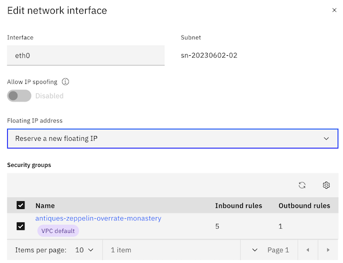
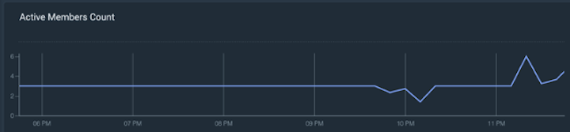

# Illustrating the Core Functionality of an Application Load Balancer and Instance Groups on IBM Cloud


## Introduction

This article serves as a guide to constructing a demonstration of an Application Load Balancer (ALB), illustrating exactly how they work, the motives for using one, and a few interesting experiments. Additionally, we'll observe the functionality of an IBM Cloud Instance Group, and illustrate how using one in conjunction with an ALB can help us deliver highly-available and scalable web applications.

ALBs play an important role in how enterprises deliver software (in this case, web-based applications) to their customers. A copious amount of deliberation should be put into validating this kind of architecture, including load balancer configurations, routing algorithms, health checks, persistent storage, etc. Proper consideration and configuration are vital to ensuring applications are fully functional and available to end users.

For a more detailed explanation on load balancing, visit this article from IBM: https://www.ibm.com/topics/load-balancing. Depending on your level of experience in the realm of networking, you may find that the experiments in this writeup are fairly rudimentary. The goal is to bring some foundational concepts to life with unique illustrations while reinforcing concepts vital to application uptime. This writeup should provide exercises appropriate for most experience levels.

We'll start by deploying properly configured VPC infrastructure, including an ALB and instance group, then tamper with the configurations enough to illustrate when and why it might break, why that behavior should or should not be expected, and how to avoid some common pitfalls.

## Prerequisites

An IBM Cloud account with Manager or higher permissions for VPC, and Editor or higher level platform permissions

*Use the code VPC1000 for $1,000 in IBM Cloud VPC credits! This will more than cover the cost of the lab, which will only be a nominal expense since we'll destroy the environment afterwards.*

Chrome, Edge, or Firefox are recommended, although Safari may suffice

## Phase 1 - Create a Virtual Private Cloud (VPC)

From the IBM Cloud Portal, create a VPC with the following configurations, most of which will be pre-populated for you:

**Location**: Region of your choice (Take note of this region, we will need to reference it again several times throughout the lab)

**Name**: lb-demo-vpc

**Resource group**: Default (others can be used as desired)

Maintain the default values of the remaining configurations, including:

- Default Security Group: Should remain checked, allowing SSH and PING
- Classic Access: can remain unchecked
- Default address prefixes: should remain checked
- Subnets: Default values, including address spaces should be used

Your VPC should be created within a few moments. **Navigate to your VPC**, then to the **Default Security Group** listed for your VPC.

From your default security group, navigate to the "**Rules**" tab.

First, as a best practice, let's restrict port 22 to your machine's IP address.

- Select "**Edit**" (using the ellipses) on the inbound rule in which the "Value" is listed as "Ports 22–22."

- In the "**Edit inbound rule**" pane, change "**Source Type**" to "**IP address**" and enter your machines IP address. You can retrieve your machine's IP address by navigating to https://www.ipchicken.com/ in a separate tab

- Keep in mind that your local network is likely using Network Address Translation, which (in short) means that your IP address is being assigned by the local router. In the event that you are completing this lab in multiple sittings in different locations, you'll want to update the IP address in this rule accordingly.

- Save the newly configured rule containing your IP address.

Next, create a new inbound rule with the following configurations.

**IMPORTANT**: Please note that adding this rule will expose virtual server instances that we create in later exercises to the internet over port 80 (HTML protocol). Please ensure you take the proper precautions. If you borrowed a colleague's VPC for this exercise (instead of creating a new VPC as shown in the steps above), please consider the repercussions and leverage strictly lab environments that do not have connectivity to company resources.

- Protocol: TCP
- Select "Port Range"
- Port min: 80
- Port max: 80
- Source type: Any

## Phase 2 - Create the Load Balancer

Within VPC Infrastructure, create a Load Balancer with the following configurations:

- Load balancer type: ALB
- Region: Same region as your VPC
- Name: lb-demo
- Resource Group: Default (others can be used as desired)
- Virtual Private Cloud: demo-vpc (that you created earlier)
- Type: Public
- DNS Type: Public
- Subnets: Select all three subnets

Create a back-end pool by clicking "Create pool" and enter the following configurations:

*Most of these configurations will be populated by default*

- Name: demo-pool
- Protocol: HTTP
- Session stickiness: None
- Proxy Protocol: Disabled
- Method: Round Robin
- Health Check Path: /
- Health Protocol: HTTP
- Health Port: Should remain blank
- Interval, Timeout, and Maximum Retries can retain their default values (5, 2, and 2 respectively)

Create a front-end listener by clicking "Create Listener," and enter the following configurations:

*Most of these configurations will be populated by default*

- Default back-end pool: demo-pool
- Protocol: HTTP
- Proxy protocol: should remain unchecked
- Listener port: 80
- Max connections: Should remain blank
- Timeout: Can retain its default value of 50 (seconds)

**Check over your configurations and click "Create" to begin provisioning the load balancer. This process will take a few minutes. While you wait, proceed to phase 3.**

## Phase 3 - Create an Instance Template

Within VPC Infrastructure, create an instance template with the following configurations.

- Server Type / Architecture: Intel
- Hosting type: Public
- Location: Same Region as your VPC, any zone
- Name: lb- demo
- Resource Group: Default (others can be used as desired)
- Operating System (Stock Image): Ubuntu Linux 22.04
- Profile: Balanced, bx2–2x8 (2 vCPUs | 8 GB RAM)
- SSH keys: If you have existing keys shown in the IBM Cloud portal, AND you still have the private key of the key pair on your local machine, feel free to select the appropriate existing key
- Otherwise:
    - Generate a new key pair on your machine using the appropriate process for your operating system.
    - For Windows users, follow the steps in this tutorial: https://learn.microsoft.com/en-us/windows/terminal/tutorials/ssh
    - For Mac users, execute the command ssh-keygen in your terminal, and follow the prompts to create the key pair.
    - Then, copy the contents of your public key file to your clipboard. Mac users can execute the following command in their terminal (after populating with your path and public key name) to output the contents of your public key.
        ```console
        cat <path>/<name_of_pub_key>.pub
        ```
    - *Keep in mind the file extension of the public key is .pub, not .pem*

    - Enter the public key into the prompts that follow "Create an SSH Key" in the IBM Cloud Portal. A simple copy and paste from your terminal into the text box should result in a properly formatted key. Use the screenshots below to validate or help with formatting your public key in the text box as needed. Of course, your full key will be different than the (portions of a) key shown in the screenshots.

        
        
        

        *Top of text box containing your public key*

        

        *Bottom of text box containing your public key*


- Skip the storage sections - the default configuration of a single boot volume will suffice for this lab.
- In the Networking section, select the VPC you created previously
- Skip the Network Interfaces section
- Under Advanced Options, update the user data with the following script: https://github.com/atugman/IBM-Cloud/blob/main/Labs/ALB-Lab/lb-user-data.sh

**IMPORTANT**- *ensure you capture the entire script, including the first line:*

```console
#!/bin/bash 
# ^---make sure the line above is the first line of your user data
# followed by the remainder of the script!
...
```

*We'll dive into the specifications of the script a bit later.*

*Review and create the Instance Template.*

## Phase 4 - Create an Instance Group

First, validate that your ALB and its back-end pool and front-end listeners have been successfully created, as shown in the following screenshots.


*Active ALB*


*Back-end pool with 3/3 healthy instances attached*


*Front-end listener, using the HTTP Protocol over Port 80*

Once your ALB, back-end pool and front-end listener are in a ready state, create an instance group with the following configurations.

- Location: Same region as your VPC
- Name: lb-demo
- Resource group: Default (others can be used as desired)
- Select the instance template you created in the previous step
- Select all three subnets of your VPC
- Check the box to indicate you will be using a load balancer
- Select the load balancer created previously
- Select the back-end pool created previously
- Application Port: 80
- Scaling Method: Dynamic
- Minimum Instances: 3
- Maximum Instances: 6
- Aggregation window: 90
- Cooldown period: 120
- Do not create any scaling policies at this time

## Phase 5 - Test the Functionality of your Load Balancer

The application will take 2–3 minutes to deploy, but after approximately 30 seconds, you can continue with the following steps in the meantime. Drill into your newly create Instance Group.

- Retrieve the private IP addresses of each of the 3 instances in your instance group. This can be done by drilling into each of the instances listed under the "Memberships" tab. Optionally, take note of the instance names as well.

- Navigate back to your load balancer in the IBM Cloud portal.

- Retrieve the "hostname" for your load balancer, and paste it into your web browser. The "hostname" can be retrieved from the list of load balancers, or by drilling into your load balancer.

*You may need to pause here for another minute until the application is deployed.
*
Take note of the instance name and IP address presented on the webpage (don't worry about the webform yet!)

- You should see the private IP address of one of the instances in your instance group.
- The user data script we added to our instance template gets executed on each of the instances we scaled up, and renders a simple webpage displaying the private IP address of the instance that the load balancer routed the HTML request to.
- Only the ALB was assigned a public IP address. The ALB routes traffic to nodes uses their private IP addresses!

Refresh the page, and again, take note of the instance name and IP address presented.
- The IP address presented on the webpage after refreshing should be different than the first, but you should still recognize the private IP address as one belonging to another instance in your instance group.
- Formulate a theory as to why our load balancer routed your request to a different instance.

Refresh the page several more times.
- Take note of the IP address presented on each refresh.
- Take note of the pattern in which your HTML requests are being routed.

So why does our load balancer select a new instance every time we refresh the page?

When we created the load balancer, we selected the Round Robin routing algorithm. Therefore, this behavior is expected. You can read more about routing algorithms available for IBM Cloud ALBs here if you'd like! https://cloud.ibm.com/docs/vpc?topic=vpc-load-balancers&interface=ui

But what if our application is stateful in nature, and requires access to data written to the disk of our VSI?

## Phase 6 - Additional Experiments

In the last phase, we saw firsthand what a round robin load balancing algorithm looked like. Our load balancer routed each new web request to each subsequent (and healthy) node registered to it. Let's conduct a few more experiments.

### IP Stickiness

You may have already noticed this, but observe how the stored value changed on each page refresh in your round robin algorithm. Well, there is a 98% chance that it was different than the value on the previous page. This is because the value is pulling from a local file, and, as we learned, the round robin algorithm selects a different node for each subsequent page request. The user data script that we fed to our instance group simply selected a random number between 1 and 50 (for each node), and wrote each node's random number to a file. Our HTML page simply displays each node's random number.

Although the value of the stored data is minimal for the purposes of this demonstration, imagine a real-world scenario where the node needs to store more pertinent information about the user interacting with it. It would be catastrophic if, say I had 21 items in my shopping cart for a given website, but if I were to refresh the page, I might end up with 47 of someone else's items showing in my shopping cart!

Now, there are many ways to architect your applications to avoid this scenario. One common solution would be to store information in a database, and to query the database as appropriate. Local storage, however, can provide for a much faster user experience than this, so there are reasons to consider one approach over the other for different types of data and different performance requirements. In a future writeup, we'll discuss NFS storage in Kubernetes.

Now, update your back-end pool configuration to use sticky sessions:


After saving the configuration, wait a few moments, and refresh the page (a few times, if you'd like). You should notice two things: neither the IP address nor the stored value should be changing on a page refresh. Despite the use of our round robin algorithm, we've configured our load balancer to route HTML requests coming from a given IP address to the same node each time. Each subsequent source IP address will be routed to the next node in the round robin. This ensures that any information we need from local storage can be persisted throughout the user's session.

### Session Storage via your Web Browser

To illustrate session-based storage we'll use the web form on the page. Enter a number between 0 and 9, and click submit. Refresh the page a few times, and take note as to whether or not the session value changes on each page refresh.

Once you've confirmed that it is not changing, let's undo our previous configuration change. Revert your load balancer to the previous configuration - set session stickiness back to "none," meaning it will respect the round robin algorithm and route each HTML request to a new instance on each page refresh, regardless of the source IP address.

Give the updated configuration a few moments to persist, and (you guessed it), refresh the page a number of times to see what the result is. Feel free to update your session value manually by submitting a new number between 0–9 into the web form. But know that the session value should not change as a result of a page refresh, regardless of whether or not we have enabled the sticky IP functionality in our ALB, and the stored value only persists when we've enabled sticky IP.

Using JavaScript, we've enabled this session value from the web form to persist on a page refresh, even if a different instance is handling our HTML request. The session storage is not stored on any of the instances' disks, but rather in your browser.

*You'll also notice if you open the webpage in a private browser, the value will not be saved. If you don't see any note on the page about a session value, that also means that it did not persist, as there is no current session value.*

Optionally, inspect the application's source code using your browser's Developer Tools. The JavaScript code is embedded directly in the index.html file within the `<script>` tags.


Additionally, in your dev tools, navigate to the "Application" tab, and expand the "Session Storage" section. Click on the item in this section, and you should see the value that you submitted into the web form stored in your browser! Update the value a few more times by resubmitting the form, and validate that your browser is always storing the current session value.


Read more about sessionStorage in JavaScript here: https://developer.mozilla.org/en-US/docs/Web/API/Window/sessionStorage

## Phase 7 - Maybe just a few more experiments…

Let's do a few more quick experiments. What would happen if we had misconfigured the health checks of our back-end pool? What happens to our application if the load balancer cannot validate the status of our instances?

### Misconfigured Health Check

Update the health check of your back-end pool. Let's add a nonexistent path that our health check should attempt to use to validate the status of our instances. Instead of a simple "/" referring to the root directory, add a path that does not exist, such as "/fake-path/to-nothing" (excluding the quotation marks), and save the configuration.

Within a few moments, you'll find that the load balancer declares all of our instances unhealthy.


And, as you probably suspected, if you try to access the web applicaition, you'll receive a 503:


Before we move onto our next exercise reconfigure the health check correctly - replace the fake path with "/" (excluding the quotation marks) and save the configuration.

### Simulate an Issue with a Single Node

So we saw what happens when our load balancer even thinks our nodes are unhealthy. What happens if one of the nodes actually crashes? 

What if a recent software update doesn't play nicely with our (super complex) application?
Well, here is a very simple test that will emulate some of these behaviors. Simply navigate to one of your instances, and shut the instance down.

You should notice within a few seconds (we configured our health check to ping our nodes every 5 seconds) that the health status of one of the nodes will be updated to "Failing," as the ALB can no longer communicate with it.

*NOTE: the status may read as "unknown" at first, while the ALB is trying to deem it unhealthy!*

Now, head back to your application. After refreshing the page a few times, what do you notice?

Your HTML requests are now only being routed to two of your instances, right? But, if you wait just another minute…you'll soon realize that there are still three unique IP addresses receiving traffic, based on the information our web page presents after a few refreshes. Of course, the server that we just turned off couldn't possibly be receiving any traffic. So why is this the case?

Well, let's first point out one key benefit of load balancing. Luckily, our entire application did not become unavailable as a result of a single instance crashing. Distribution of our workload is the core feature and an incredible benefit of using an ALB. Now, keep in mind that this requires properly configured health checks, and that this is a simple test. But having an intelligent system determining where to route our traffic is extremely important to the successful delivery of software, in this case web-based applications. Thorough testing of your ALB configurations should be conducted prior to deploying to production.

But wait…let's not forget about this mysterious third (or fourth?) instance that started receiving traffic. If you remember back to our initial configurations, we configured our instance group to have a minimum of 3 instances! Although we have not yet enabled autoscaling policies in our particular instance group, we used dynamic scaling to set a minimum number of instances. Therefore, the instance group will deploy a new instance if for some reason something happens to one of the existing 3 instances. In a sense, we're already sort of autoscaling, with the "policy" in this sense being: *maintain at least 3 instances at all times.* And, because we configured our instance group to work with our ALB, each instance that the instance group deploys is then registered to the ALB, meaning it can receive traffic from our application (again, given that it passes the health checks).

### Instance Group Autoscaling

One last exercise - a massive CPU spike! What will happen to our ALB and Instance Group when an instance (or the aggregate of all our instances) exceeds a certain threshold of CPU utilization? Let's find out with another simple exercise.

Complete the following steps from your Instance Group:

- Ensure autoscaling is enabled

- Maintain existing configurations in terms of minimum (3) and maximum (6) instances, as well as the aggregation window (90) and cool down period (120), as this will minimize wait time!

- Add a target policy, instructing the instance group to scale up if the average CPU usage % across all instances in the group exceeds 10%.

    

    *Note that this is an impractical scaling policy that would likely result in excess compute in an instance group, but it will suffice for our lab. Remember that our maximum instance count is 6.*

- Assign a Floating IP address to one of the instances (VSIs) in your instance group

    

- Secure Shell (SSH) into your instance using its floating IP address.

- For Mac users:

    ```console
    ssh -i </path_to_private_key/private_key_name.pem> root@<floating_ip_address>ssh -i </path_to_private_key/private_key_name.pem> root@<floating_ip_address>
    ```
- Run the following command from your VSI to initiate the stress test (the stress utility was preinstalled as part of the user data script):

    ```stress -- cpu 2```

- Let this command run continuously.

If you click on the "Monitoring" tab of your VSI, you will soon be able to see the spike in CPU, similar to the screenshot below (notice the far right):

*Example CPU usage chart via IBM Cloud Monitoring; Notice the spike at the far right from our stress test!*

Our instance group has approximately 6 total vCPUs across 3 instances. Initiating a stress test that consumes 2 vCPUs (one instance) brings the average CPU utilization percentage to approximately 33%.

*NOTE: I say "approximately" as the allocatable CPU and RAM of a given instance do not perfectly align with the number of vCPUs and GB of RAM listed in the instance profiles.*

Now, given that our scaling policy will act after 90 seconds of the average CPU utilization being above 10%, we should see our instance group scale up additional instances momentarily.

Hang tight for another minute or so, and check in on the "membership count" of your instance group, as well as the number of healthy nodes registered to your load balancer.


Additionally, navigate back to your application one last time, and notice the additional IP addresses presented after several page refreshes. You should be seeing each of the 6 unique internal IP addresses of the instances in your instance group!

## Conclusion

Looking back on all of the exercises completed, we can derive several additional interesting points that from IBM Cloud Monitoring. Your precise results may vary based on many factors, but should look pretty similar to the results below.

From your ALB, click on "Launch Monitoring."


Observe the "Connections Rate (connections per sec)" graph. You may notice that a single instance (green line in the screenshot below) saw a "spike" in the average connections per second early on in the lab exercise.

*NOTE: the term "spike" should be used very loosely here - unless you shared your amazing application with many others while you worked on this lab, you application will have received a very minuscule number of connections, solely from you refreshing the page.*


However, it's fairly significant that this happened during an exercise where, for a brief amount of time, we used session stickiness to force our ALB to route requests from a single IP to the same node. This lightly illustrates the impact that session stickiness could have an individual node, based on an individual application user's behaviors and needs.

Another interesting observation is the "Active Members Count" graph. Remember how we turned a server off to simulate a node crashing? Well, that sort of things gets captured in IBM Cloud Monitoring! Many SREs love alerting mechanisms, and IBM Cloud Monitoring can support this functionality as well. Notice how the active member count was momentarily reported as less than three, but scaled back up to three without any manual intervention. Lastly, as expected, our instance group scaled up to our maximum count of six after implementing our scaling policy and stress test.



## Cleanup

Let's destroy all of the resources we created throughout the lab to avoid incurring any unnecessary expenses.

First, make sure you have halted execution of the stress test. This can be done by entering ctrl + c into the terminal where you've shelled into your VSI.

Next, attempt to delete your instance group. Your instance group will then warn you that you are attempting to delete a group with instances attached. Go ahead and confirm that this is fine to do. 

That action will initiate the deletion of the 6 instances attached to the instance group. But, you'll need to come back in a few minutes to delete the instance group itself.

Also, you should have a stray VSI in your account. This is a result of our simulation where we turned off an instance. The instance group detached the instance that we turned off and scaled up another VSI. Navigate to "Virtual Server Instances" within VPC Infrastructure.

Make sure that all instances whose names start with "lb-demo…" are deleted. Your instance group should have deleted, or should be in the process of deleting 6 of them. Look for a VSI with the same naming convention and a status of "stopped." This is our culprit that had an "issue" earlier. Delete this VSI yourself, as your instance group has completely forgotten about it, and won't delete it as it will the others.

At this point, you should be in the clear to delete the instance group itself (meaning that all 6 previously attached instances should be deleted). Go ahead and initiate the deletion of the instance group.

It should take roughly 2 minutes to for the instance group to be deleted, at which point we can delete the ALB.

The instance template that you created does not incur any charges itself. You can keep it around to quickly deploy future VSIs based on the same configurations, whether they are attached to an instance group or not. Feel free to delete the instance template to avoid any confusion with other users in your account or future deployments.

The same applies to your VPC. The VPC itself does not incur any changes, but I would recommend deleting it for good housekeeping if nothing else, but also because it has it's own unique default security group rule that would enable HTTP traffic to hit nodes that reside in the VPC.

At this point, you should be able to validate that your:

- Instance group has been deleted
- VSIs whose names begin with "lb-demo…" or the naming convention used in your instance group, have been deleted, including one(s) that were detached as a result of the lab exercises
- ALB has been deleted
- (Optional in terms of incurring charges) Instance template has been deleted
- (Optional in terms of incurring charges) VPC has been deleted

## References

https://www.ibm.com/topics/load-balancing

https://cloud.ibm.com/docs/vpc?topic=vpc-load-balancers&interface=ui

https://developer.mozilla.org/en-US/docs/Web/API/Window/sessionStorage

https://linuxconfig.org/how-to-stress-test-your-cpu-on-linux