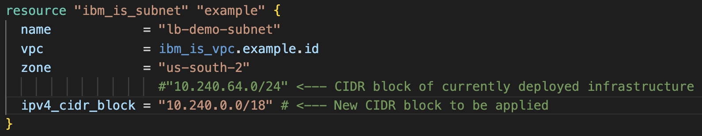

- *walkthrough under construction*
- *detailed instructions will soon be provided!*

- Simple Terraform lab

If you're following along locally, consider the following prerequisites:
- IBM Cloud Account & API Key
- Local Terraform installation

Otherwise, feel free to continue reading.

We'll use the IBM Cloud Terraform provider to walk through this simple exercise.

If you're following along, we'll first want to copy the code contained in ```main.tf``` in [this directory](https://github.com/atugman/IBM-Cloud/tree/main/Labs/Terraform-Lab/lab-files/terraform-basics-labw) locally. 

You can do this via a manual copy and paste, or by cloning the [full repository](https://github.com/atugman/IBM-Cloud/tree/main).

If you elect to use a manual copy and paste - create a file named ```main.tf``` however you'd like, but *make sure it's in its own directory*. From your local terminal, you could run a few commands like: 
- ```cd Documents```
- ```mkdir tf-basics-lab```
- ```cd tf-basics-lab```
- ```touch main.tf```

 If you prefer to clone the repository, you can do so with this command: ```git clone https://github.com/atugman/IBM-Cloud.git```. Afterwards, navigate to the appropriate subdirectory with ```cd IBM-Cloud/Labs/Terraform-Lab/lab-files/terraform-basics-lab```.

Once you've copied the code via either method and are in the appropriate directory, naturally we'll start by running the ```terraform init``` command from our local terminal. A successful output will include verbiage along the lines of: 

```
Terraform has been successfully initialized!

You may now begin working with Terraform. Try running "terraform plan" to see
any changes that are required for your infrastructure. All Terraform commands
should now work.
```

Next, let's **securely** use our IBM Cloud credentials (API key) via Terraform Environment Variables. Terraform Environment Variables (just like traditional Linux environmental variables) are extremely helpful in preventing us form exposing credentials in code. Execute the following command in your terminal, supplying your IBM Cloud API key.

```export TF_VAR_api_key=YOUR_IBM_CLOUD_API_KEY```

Let's start deploying our IBM Cloud resources. We're creating an extremely simple architecture - in fact, one that won't incur any costs. We'll stop short of deploying any actual servers or applications, but rather just a few basic resources (listed below). Nonetheless, keep in mind any dependencies that could exist between these resources!
- VPC & one subnet
- A security group, with a few simple security rules
- A resource group
- An SSH Key
- And a Virtual Server Instance *Template* (again, not an actual instance)

Let's run ```terraform plan``` as a best practice. This command will effectively **simulate** changes to your infrastructure (based on your codebase, or any changes to your codebase), without actually implementing these changes. An absolute *must* in production!

Successful execution of this command should result in a terminal message similar to:

```Plan: 9 to add, 0 to change, 0 to destroy.```

...along with a list of resources to be added to the Terraform state.

Then, run ```terraform apply``` to deploy our initial set of cloud resources.

When prompted, enter 'yes' when Terraform asks if you'd like to perform these actions (confirmation that you'd like to create these resources). 

Successful execution of this command should result in a terminal message similar to:

```Apply complete! Resources: 9 added, 0 changed, 0 destroyed.```

...again, along with a list of resources that were created and added to the terraform state.

Alright, now is the fun part. We have our initial cloud resources deployed, albeit, for the purposes of this lab, no significant resources have been deployed. 

***terraform state stored in json
***why is stateful important??

***simple change, impact
***networking commentary

```terraform state show 'ibm_is_subnet.example'```

```
resource "ibm_is_subnet" "example" {
    access_tags                  = []
    available_ipv4_address_count = 11
    ip_version                   = "ipv4"
    ipv4_cidr_block              = "10.240.64.0/24"
    name                         = "tf-basics-subnet"
    resource_group_name          = "Default"
    resource_status              = "available"
    status                       = "available"
    tags                         = []
    total_ipv4_address_count     = 16
    zone                         = "us-south-2"
}
```

<!---->

One simple change to main.tf file that could impact multiple resources. Let's see how Terraform handles this.

```
resource "ibm_is_subnet" "example" {
  name            = "tf-basics-subnet"
  vpc             = ibm_is_vpc.example.id
  zone            = "us-south-2"
                    #"10.240.64.0/24" <--- CIDR block of currently deployed infrastructure
  ipv4_cidr_block = "10.240.64.0/18" # <--- New CIDR block to be applied
}
```

```terraform plan```

```
ibm_resource_group.example: Refreshing state... [id=f8b67f59696d4a4e8943cfea689492c7]
ibm_is_ssh_key.shared_ssh_key: Refreshing state... [id=r006-ff54c905-891f-4b80-8341-13dd377aac13]
ibm_is_vpc.example: Refreshing state... [id=r006-d858550d-c9c5-45b4-bc35-c80e98de1bf4]
ibm_is_subnet.example: Refreshing state... [id=0727-b68aad4e-3bd1-4857-82f4-db5303d3df04]
ibm_is_security_group.example: Refreshing state... [id=r006-0beee3f9-5f15-4262-bc05-7c899dff1630]
ibm_is_security_group_rule.example2: Refreshing state... [id=r006-0beee3f9-5f15-4262-bc05-7c899dff1630.r006-4c6e398f-4999-4c3c-b69f-e1890bdb8173]
ibm_is_security_group_rule.example1: Refreshing state... [id=r006-0beee3f9-5f15-4262-bc05-7c899dff1630.r006-8a90622c-50a2-45d5-8dd4-1df5d1a54959]
ibm_is_security_group_rule.example: Refreshing state... [id=r006-0beee3f9-5f15-4262-bc05-7c899dff1630.r006-2dd4851f-b17f-432e-81ad-0492b86d77bc]
ibm_is_instance_template.example: Refreshing state... [id=0727-3cbab154-a94e-4d1e-a76c-c1c20182047f]

Terraform used the selected providers to generate the following execution plan. Resource actions are indicated with the following
symbols:
-/+ destroy and then create replacement

Terraform will perform the following actions:

  # ibm_is_instance_template.example must be replaced
-/+ resource "ibm_is_instance_template" "example" {
      + availability_policy_host_failure  = (known after apply)
      + default_trusted_profile_auto_link = (known after apply)
      ~ id                                = "0727-3cbab154-a94e-4d1e-a76c-c1c20182047f" -> (known after apply)
      + metadata_service_enabled          = (known after apply)
        name                              = "tf-basics"
      ~ placement_target                  = [
          - {
              - crn  = null
              - href = null
              - id   = null
            },
        ] -> (known after apply)
        # (6 unchanged attributes hidden)

      ~ boot_volume {
          + encryption                       = (known after apply)
            name                             = "example-boot-volume"
          ~ profile                          = "general-purpose" -> (known after apply)
          ~ size                             = 100 -> (known after apply)
          ~ tags                             = [] -> (known after apply)
            # (1 unchanged attribute hidden)
        }

      + metadata_service {
          + enabled            = (known after apply)
          + protocol           = (known after apply)
          + response_hop_limit = (known after apply)
        }

      ~ primary_network_interface {
          ~ name                 = "huntress-audio-unsightly-viability" -> (known after apply)
          + primary_ipv4_address = (known after apply)
          ~ subnet               = "0727-b68aad4e-3bd1-4857-82f4-db5303d3df04" -> (known after apply) # forces replacement
            # (2 unchanged attributes hidden)

          ~ primary_ip {
              + address     = (known after apply)
              ~ auto_delete = false -> (known after apply)
              + name        = (known after apply)
              + reserved_ip = (known after apply)
            }
        }
    }

  # ibm_is_subnet.example must be replaced
-/+ resource "ibm_is_subnet" "example" {
      ~ access_tags                  = [] -> (known after apply)
      ~ available_ipv4_address_count = 251 -> (known after apply)
      ~ id                           = "0727-b68aad4e-3bd1-4857-82f4-db5303d3df04" -> (known after apply)
      ~ ipv4_cidr_block              = "10.240.64.0/24" -> "10.240.64.0/18" # forces replacement
        name                         = "tf-basics-subnet"
      ~ network_acl                  = "r006-6888995e-1fbc-4a51-9d3f-3a6ecac42a42" -> (known after apply)
      + public_gateway               = (known after apply)
      ~ resource_controller_url      = "https://cloud.ibm.com/vpc-ext/network/subnets" -> (known after apply)
      ~ resource_group               = "bf9d125f31ad41df8f528ff5719ee757" -> (known after apply)
      ~ resource_group_name          = "Default" -> (known after apply)
      ~ resource_name                = "tf-basics-subnet" -> (known after apply)
      ~ resource_status              = "available" -> (known after apply)
      ~ routing_table                = "r006-2fce0ff3-9ceb-41c2-b1e1-2db595920f4a" -> (known after apply)
      ~ status                       = "available" -> (known after apply)
      ~ tags                         = [] -> (known after apply)
      ~ total_ipv4_address_count     = 256 -> (known after apply)
        # (3 unchanged attributes hidden)
    }

Plan: 2 to add, 0 to change, 2 to destroy.
```

```terraform apply```

```
ibm_is_instance_template.example: Destroying... [id=0727-3cbab154-a94e-4d1e-a76c-c1c20182047f]
ibm_is_instance_template.example: Destruction complete after 2s
ibm_is_subnet.example: Destroying... [id=0727-b68aad4e-3bd1-4857-82f4-db5303d3df04]
ibm_is_subnet.example: Still destroying... [id=0727-b68aad4e-3bd1-4857-82f4-db5303d3df04, 10s elapsed]
ibm_is_subnet.example: Destruction complete after 14s
ibm_is_subnet.example: Creating...
ibm_is_subnet.example: Still creating... [10s elapsed]
ibm_is_subnet.example: Creation complete after 12s [id=0727-b0e1b316-bdb3-4baa-bc1c-4fa5a671ff3d]
ibm_is_instance_template.example: Creating...
ibm_is_instance_template.example: Creation complete after 2s [id=0727-a47290d2-1c76-492e-b9f1-bbce6d24bfa6]

Apply complete! Resources: 2 added, 0 changed, 2 destroyed.
```